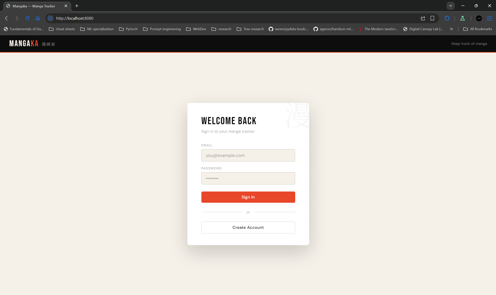
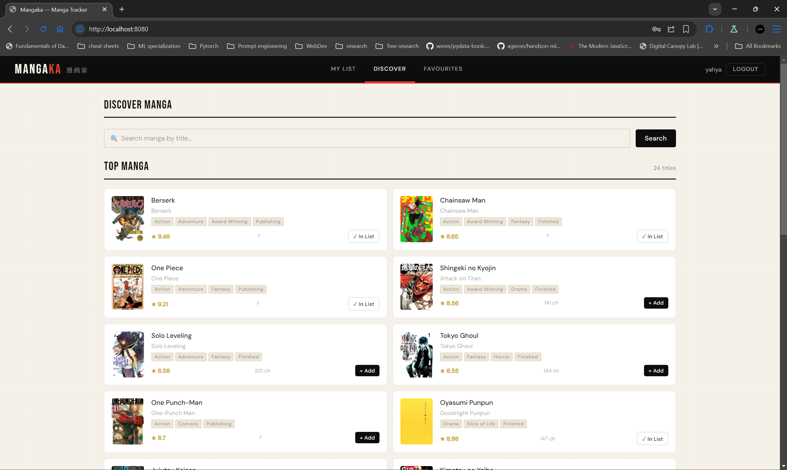
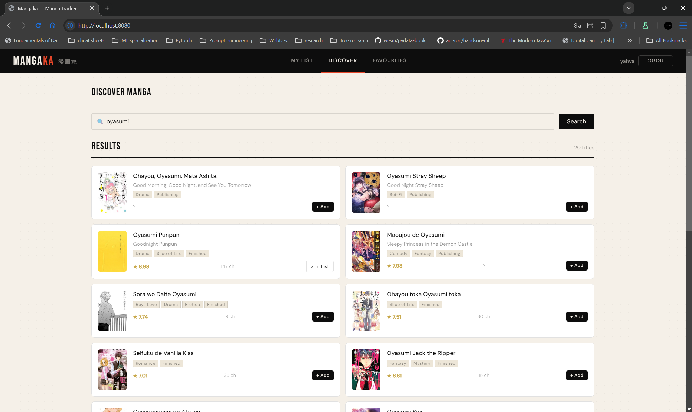
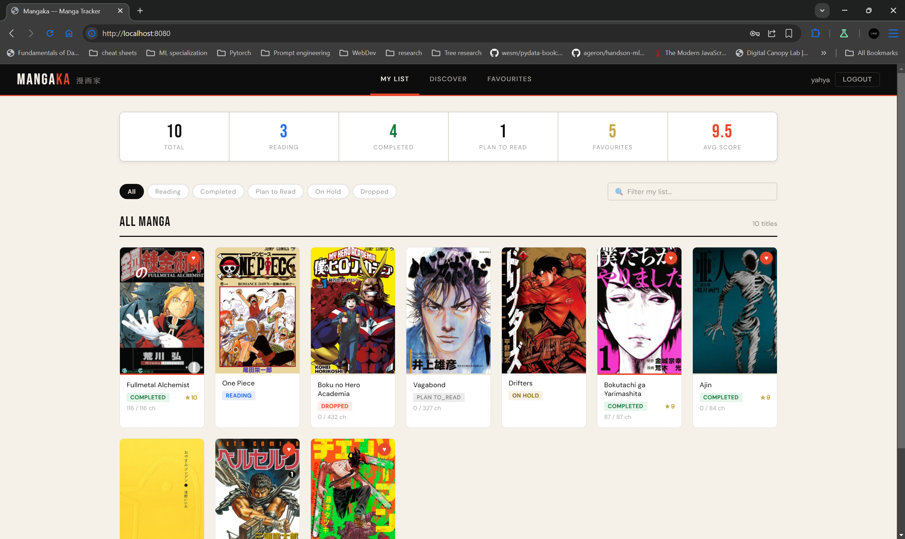
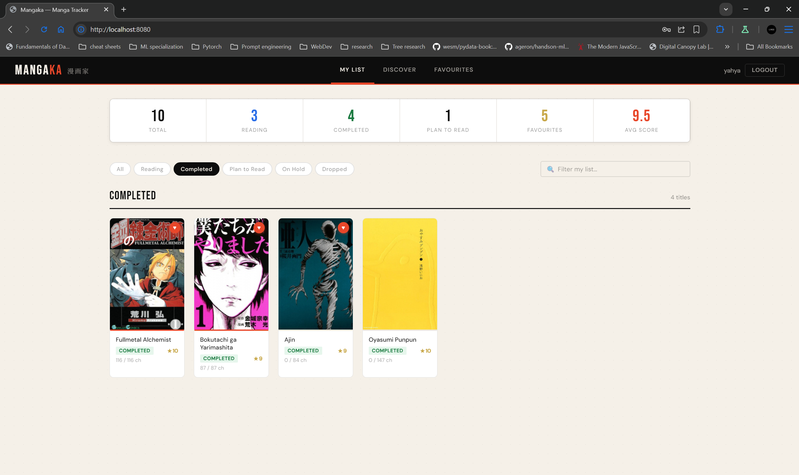
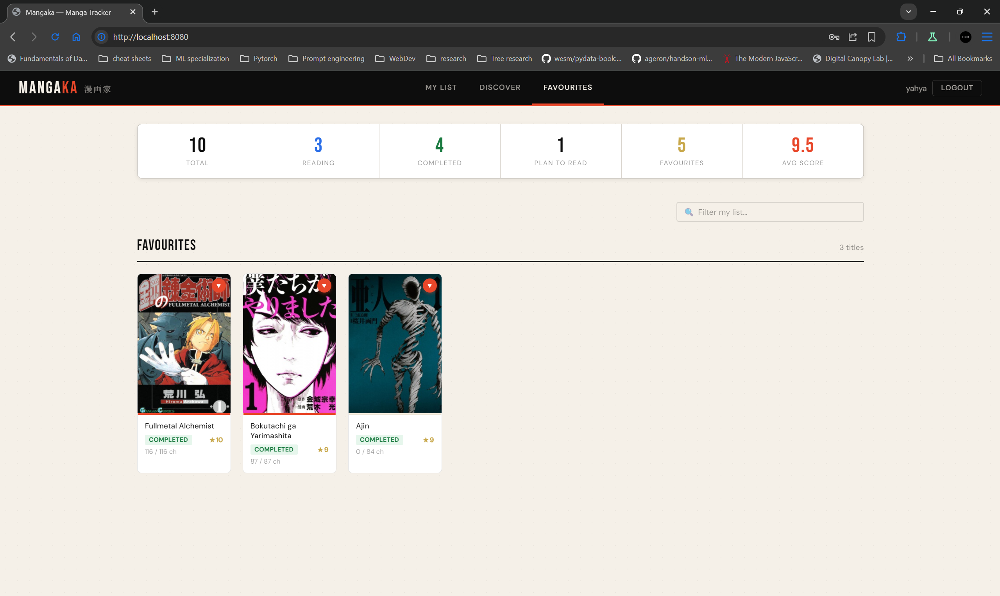
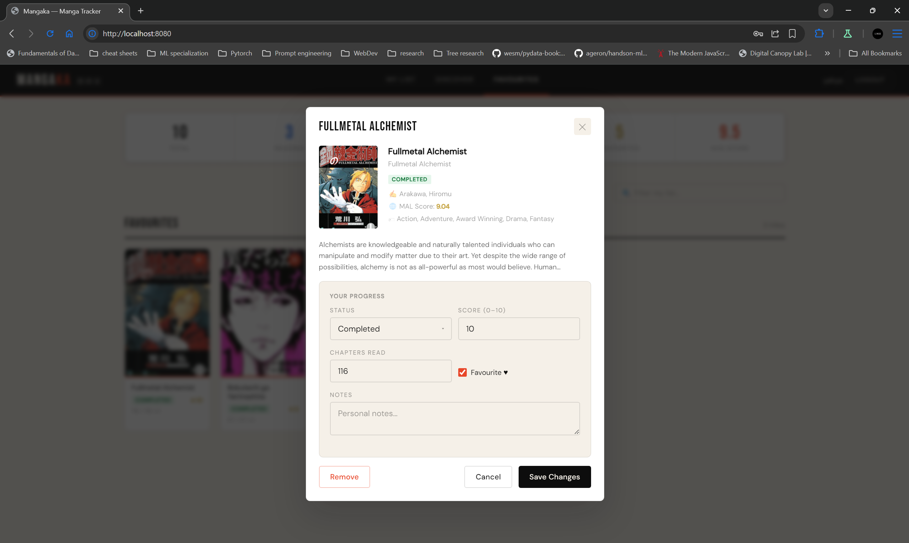
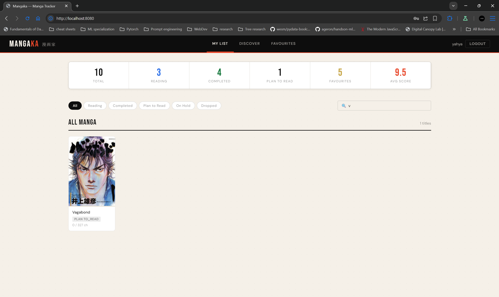

# Mangaka — Manga Tracker 漫画家

A full-stack manga tracking web application. Search for manga via the Jikan/MyAnimeList API, build your personal reading list, track progress, score titles, and curate a favourites collection.

## Project Summary

Mangaka lets authenticated users search millions of manga titles through the free [Jikan API](https://jikan.moe/) (unofficial MyAnimeList), add them to a personalised list with status, chapter progress, and personal scores, and view aggregated reading stats on a dashboard. The backend is FastAPI + SQLAlchemy (SQLite); the frontend is Alpine.js with no build step required.

## Quick Start

### Prerequisites

- Python 3.11+
- Any modern browser

### 1. Clone & set up the backend

```bash
cd backend
python -m venv venv
source venv/bin/activate          # Windows: venv\Scripts\activate
pip install -r requirements.txt
cp .env.example .env              # Edit JWT_SECRET_KEY if desired
uvicorn main:app --reload --host 0.0.0.0 --port 8000
```

API docs available at: http://localhost:8000/docs

### 2. Serve the frontend

In a second terminal, from the project root:

```bash
cd frontend
python -m http.server 8080
```

Open http://localhost:8080 in your browser.

### 3. Use the app

1. Register a new account on the login screen
2. Go to **Discover** to search manga
3. Click **+ Add** on any title to add it to your list
4. Return to **My List** to view and update your entries
5. Mark favourites with the ♥ checkbox; view them in the **Favourites** tab

## Features

- **Authentication** — Secure JWT-based register, login, and logout; passwords hashed with pbkdf2_sha256
- **Manga search** — Real-time search via Jikan API with genre tags and scores
- **Top manga browser** — Loads top manga by popularity on the Discover page
- **Reading list (CRUD)** — Add, update status/progress/score/notes, and remove entries
- **Chapter progress bar** — Visual progress for series with known chapter counts
- **Favourites** — One-click favourite toggle with dedicated view
- **Stats dashboard** — Live counts by status and average personal score
- **Data scoping** — Each user sees only their own data; cross-user access returns 404
- **Responsive design** — Works on mobile and desktop

## Technology Stack

| Technology              | Version   | Role                                  |
| ----------------------- | --------- | ------------------------------------- |
| FastAPI                 | 0.115.6   | Backend REST API + Jikan proxy        |
| SQLAlchemy              | 2.0.36    | ORM (SQLite in dev, PostgreSQL-ready) |
| Pydantic                | 2.10.4    | Request/response validation           |
| python-jose             | 3.3.0     | JWT signing/verification              |
| passlib (pbkdf2_sha256) | 1.7.4     | Password hashing                      |
| httpx                   | 0.28.1    | Async Jikan API proxy client          |
| uvicorn                 | 0.34.0    | ASGI server                           |
| Alpine.js               | 3.x (CDN) | Reactive frontend (no build step)     |
| Jikan API v4            | —         | Manga data (free, no key required)    |
| pytest + TestClient     | —         | Backend unit and integration tests    |

## Running Tests

```bash
cd backend
pip install pytest httpx
pytest test_main.py -v
```

Tests use an isolated SQLite database and cover authentication, all CRUD operations, stats, data scoping, and input validation. No network calls are made during testing.

## Screenshots

















## Known Limitations

- Jikan API rate-limits to 3 req/s and 60 req/min; heavy searching may briefly return 429 errors (the proxy returns a 502 in that case — just wait a second and retry).
- The Jikan search endpoint does not support advanced filters (by genre, year, etc.) — title search only.
- Sessions persist via `localStorage` JWT; clearing browser storage logs you out.
- No password reset flow implemented.
- `updated_at` auto-update relies on SQLAlchemy's `onupdate` hook; verify this triggers correctly in SQLite if timestamps are critical.
